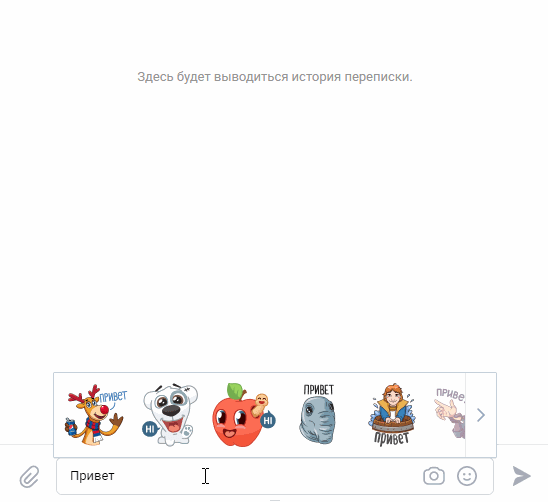

# Chatty-bot
**Бот-помощник для telegram и для vk.com, который отвечает на вопросы пользователей, 
если его научить ;-)**

Это простой бот-помощник для telegram и для vk.com, который может отвечать на вопросы пользователей. 
Для распознавания речи используется сервис DialogFlow. 
Для того чтобы бот понимал, что хочет пользователь, бота нужно обучить. 
К счастью с помощью DialogFlow это делается просто.


### Как установить

Для работы бота необходимо установить 3 переменные окружения: 

`TELEGRAM_TOKEN` - это токен телеграм-бота. Чтобы его получить, зарегистрируйте бота 
с помощью BotFather

`VK_TOKEN` - это токен vk-бота. Чтобы его получить, создайте группу в vk.

`GOOGLE_APPLICATION_CREDENTIALS` - путь к JSON-файлу, который содержит ваш Service account key.

Python3 должен быть уже установлен. 
Затем используйте `pip` (или `pip3`, есть конфликт с Python2) для установки зависимостей:
```
pip install -r requirements.txt
```

### Как запустить:
```console
$ python3 telegram_bot.py
```
```console
$ python3 vk_bot.py
```

### Как обучить:
```console
$ python3 training.py
```
### Пример результата для Telegram: 

### Пример результата для vk:


### Цель проекта
Код написан в образовательных целях на онлайн-курсе для веб-разработчиков [dvmn.org](https://dvmn.org/).